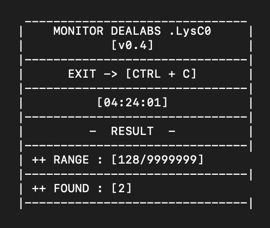
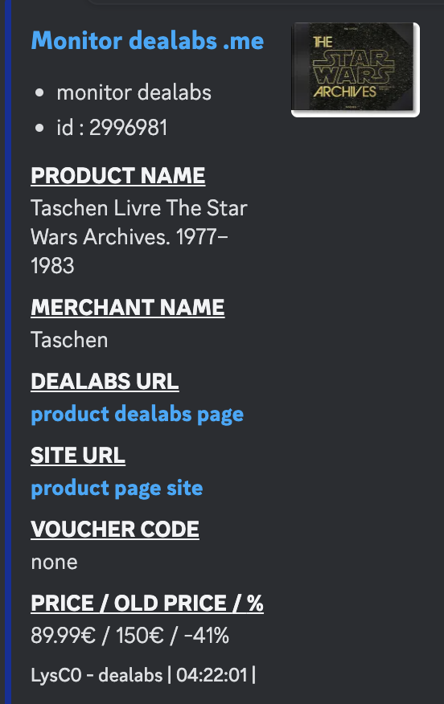

# Dealabs Monitor [WIN/MACOS/LINUX]

## Monitoring Dealabs Website [Fr] 
### Feature :
- Keyword
- Undetectable
- Can be host

## Preview :

## Instruction : 

## [STEP 1] - install [required lib]

- pip install -r requirements.txt

## [STEP 2] - setup .json file

- dealabs_url : monitoring link (only dealabs link ex : https://www.dealabs.com/top or https://www.dealabs.com/nouveaux..)
- webhook : url discord webhook
- range : monitoring range number (put a high number, ex : 999999) or more 
- await_time : loop await time (ex : 2)
- platform : choose [only 1 platform] -> Win | MacOS | Linux
- keywords : specific keyword(s) (check setup.json for exemple)

## [STEP 3] - how to run the monitor ? ##

into the directory (dealabs_monitor_v0.4) run this command :
- python3 monitor_dealabs.py

## dm bug fix / add feature ##
discord  .saill
